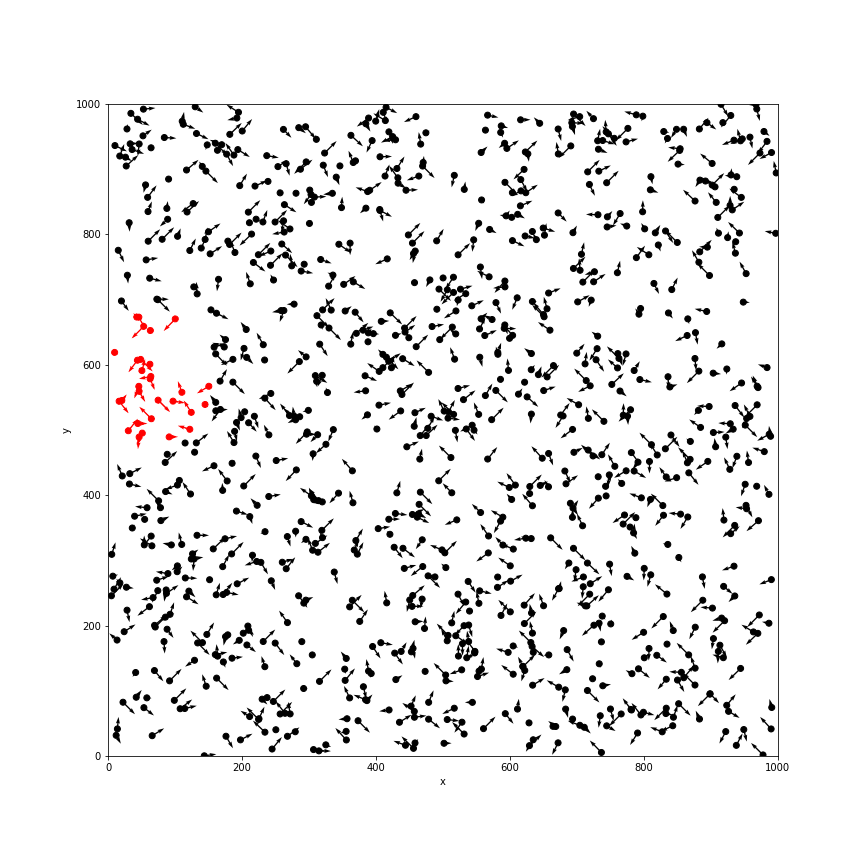

# vivarium_examples
Using Vivarium, IHME's Python microsimulation https://github.com/ihmeuw/vivarium

# Boids
Use microsimulation to model bird flocking behavior, and then model disease spread under various behaviors. 
#### Adapted from official Vivarium tutorial: 
 https://vivarium.readthedocs.io/en/latest/

### Sample Simulation 1 - 1000 simulants

### Sample Simulation 2 - 1000 simulants

 
### Notebook of how to run simulation
`vivarium_examples/boids/2018_11_24_boids_tutorial.ipynb`

### TODO 
- add infection curves
